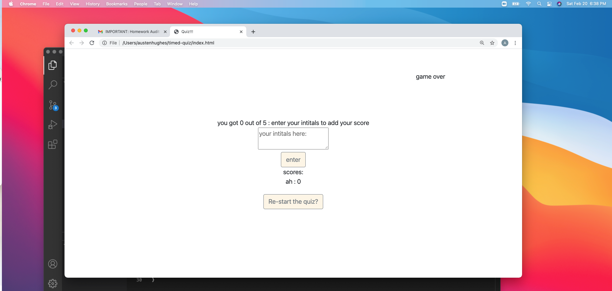

# timed-quiz

how this quiz works : 

- This is a a timed-quiz 
- To start quiz the push the start button 
- You will be given 20 seconds to complete the quiz 
- Time remaining will be displayed with a countdown clock in the upper right hand corner 
- If you get a question wrong 5 seconds will be taken away from the time remaining
- To select an answer just click on the answer you wish to chose 
- The quiz is over when you have either answered all questions or run out of time 
- The score is tracked and will be displayed on a score card 
- You will be given a chance to add your initials to your score and save them
- You can restart the quiz and add as many sets of scores as played in that session 
- When you close the reload the page the scores will not be saved giveing you a blank score card to try again 

picture of start : 

picture of question being asked : 

picture of score card with one previous score saved : 

link to site : https://austenhughes.github.io/timed-quiz/.
